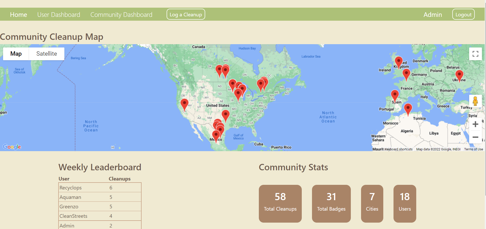
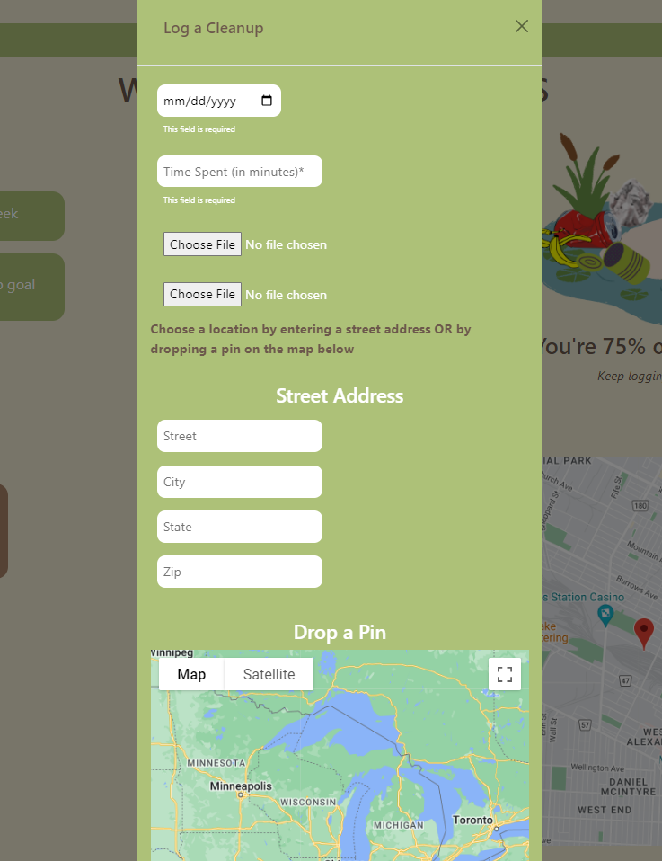

# Litter Picker

Capstone project for devCodeCamp bootcamp. This project was built in a 2 week sprint.

Technologies used:

Backend:

- Python
- Django Rest Framework
- MySQL Database
- Postman (for testing)

APIs:

- Google Maps
- Google Geocoding
- Custom built with Django

Frontend:

- React.js
- Javascript
- HTML
- CSS
- Axios API calls
- Bootstrap/React Bootstrap

Litter Picker is a fitbit-like tracker for cleaning up litter. See highlights below

User Dashboard:

Community Dashboard:

Log a cleanup:

